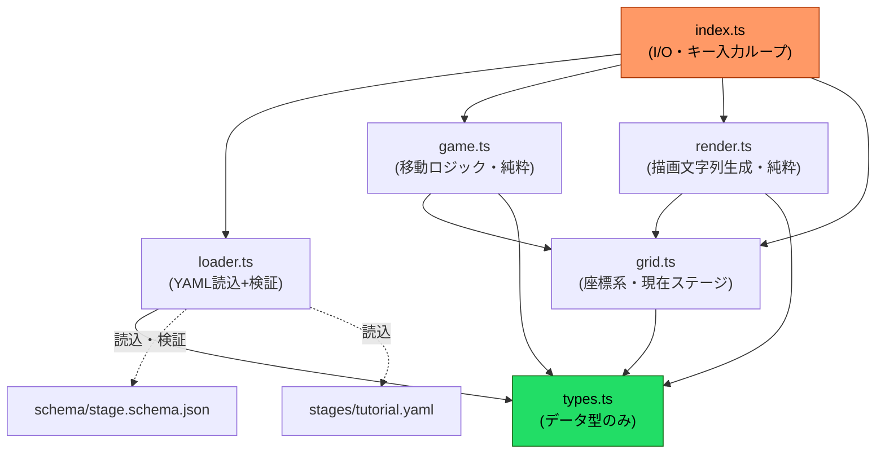
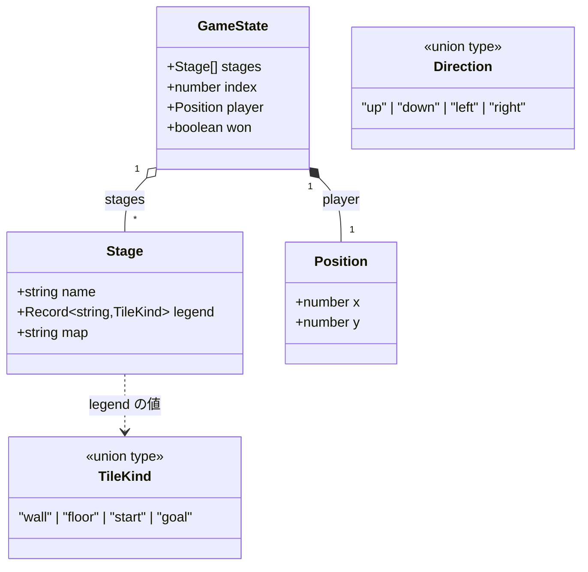
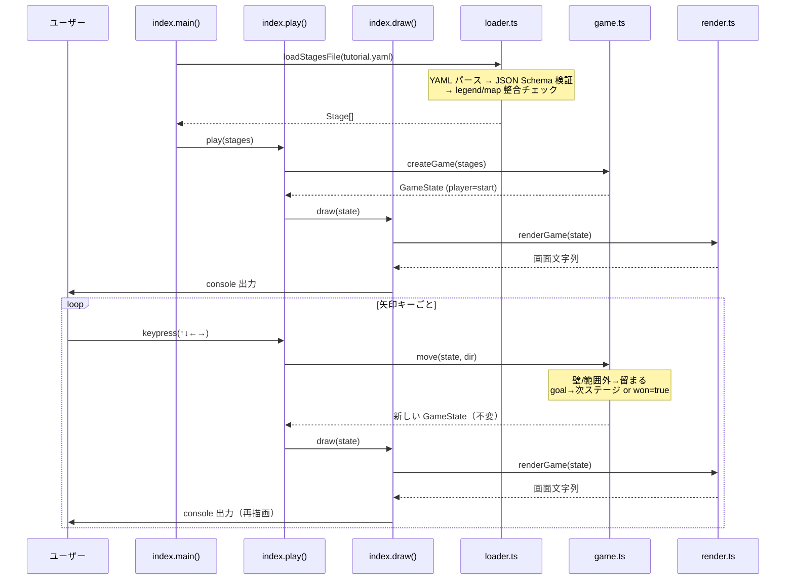

# yaml-crawl アーキテクチャ（UML スナップショット）

現時点の構成を UML 図でまとめたもの。コールドスタート時は PLAN.md /
`summary/m0-m3-overview.md` と合わせて読むと全体像が早い。

一言でいうと「YAML でダンジョンを書いて矢印キーで潜るミニゲーム」。
設計の肝は **内向き依存（クリーンアーキテクチャ的）** で、純粋関数（テスト可能）と
I/O（副作用）をきっちり分けている点。

## ① モジュール依存図（コンポーネント図）

依存はすべて内側（`types.ts`）へ向く。矢印は「〜に依存する」。

ポイント:
- **`types.ts` が一番内側** — 何にも依存しない（`Stage` / `GameState` などデータ型だけ）。
- **`render` は `game` に依存しない** — 両方 `GameState` を受け取るだけで、描画とロジックが独立。
- **実行時のユーザー I/O（描画・入力）は `index.ts` だけ** — `console` / `readline` / `process` を触るのはここだけ。ロジックは全部純粋関数（`loader.ts` は起動時のファイル読込 I/O のみ）。

## ② データ型のクラス図

`GameState` が複数 `Stage` を持ち、`index` で「今どのステージか」を指す。
`map`（文字列）の 1 文字を `legend` で `TileKind` に変換する。

## ③ 起動〜移動の流れ（シーケンス図）

`index.ts` は `main()`（ステージ読込）と `play()`（状態生成・入力ループ・描画）に
責務が分かれている。描画は `play`/`draw` 内の副作用関数 `draw()` が `renderGame` を
包んで `console` へ出す。

## 設計上のポイント

| 仕組み | どこ | 狙い |
|---|---|---|
| **`move` は純粋関数** | `game.ts` | 新しい `GameState` を返す（不変）。`vitest` で状態遷移を直接テストできる |
| **座標系の集約** | `grid.ts:toRows` / `tileKindAt` | 描画と移動判定が同じ座標系を共有。ズレない |
| **表示文字の集約** | `render.ts:GLYPH` | 将来 `chalk` で色付けする時もここだけ直せばよい |
| **2 段階検証** | `loader.ts` | JSON Schema（構造）＋ セマンティック（start=1 個 等）で壊れた YAML を弾く |

## 現在地

PLAN.md 準拠で **M0〜M4a 完了**（矢印キーで遊べ、`---` で複数ステージを連続クリア可）。
次は M4b（鍵・扉、Issue #14）着手前。
